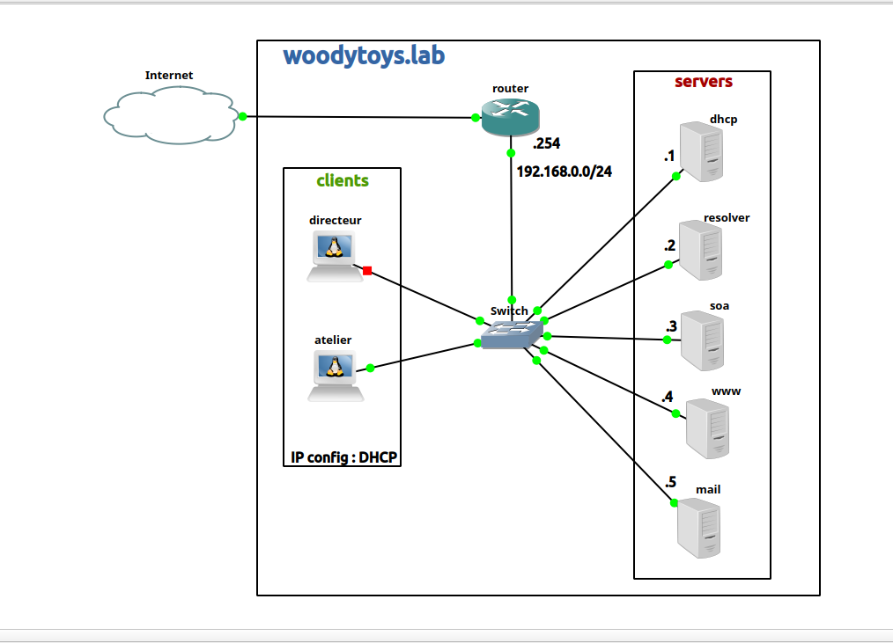

# Rapport d'Intervention : Analyse Wireshark et Correction de Routage

**Auteur :** Kylian Mostin-Vanderplanck  
**Date :** 14/01/2026 
**Sujet :** Latence et échec de connexion HTTP (Problème de Routage / ICMP Redirect)  Exercice Web 1
**Outil de diagnostic :** Wireshark

---

## 1. Schéma du Labo


---

## 2. Description de l'Incident

### Symptômes observés
L'accès au site web `http://blog.woodytoys.lab` est lent ou échoue (Time out), alors que la résolution de nom semble fonctionner.

### Analyse de la trace réseau (Wireshark)
Une capture de paquets a été réalisée sur le client pour comprendre l'échec de la connexion TCP.


*(Insérer ici ton image image_1842e8.jpg)*

**Observations critiques :**
1.  **DNS OK (Trames 1-2) :** La résolution DNS fonctionne correctement. Le serveur `192.168.0.2` renvoie bien l'IP `192.168.0.4` pour le serveur Web.
2.  **TCP Retransmission (Trames 3, 7, 9) :** Le client tente d'initier une connexion TCP (SYN) vers le serveur Web mais ne reçoit pas d'accusé de réception (ACK) correct à temps.
3.  **ICMP Redirect (Trames 4, 8, 11) :** Le serveur DNS (`192.168.0.2`) envoie des alertes de redirection au client.

---

## 3. Diagnostic (Root Cause)

La présence des paquets **ICMP Redirect** provenant de `192.168.0.2` indique une anomalie de routage côté client.

* **Le problème :** Le client envoie les paquets destinés au serveur Web (`192.168.0.4`) vers le serveur DNS (`192.168.0.2`) au lieu de les envoyer directement sur le réseau local ou via la bonne passerelle.
* **La cause :** Une mauvaise configuration distribuée par le serveur DHCP. Le serveur DHCP a probablement configuré le client avec :
    * Soit une **Passerelle par défaut (Router)** pointant vers `192.168.0.2` (le DNS) au lieu de `192.168.0.254` (le Routeur).
    * Soit un **Masque de sous-réseau (Netmask)** incorrect (ex: `/32` au lieu de `/24`), forçant le client à passer par une passerelle pour joindre ses voisins directs.

---

## 4. Solution Mise en Œuvre

Correction de la configuration du serveur DHCP pour distribuer les bons paramètres de routage.

### Étape 1 : Correction du fichier dhcpd.conf
Sur la machine `dhcp` (`192.168.0.1`), édition du fichier de configuration :

```bash
nano /etc/dhcp/dhcpd.conf
subnet 192.168.0.0 netmask 255.255.255.0 {
    range 192.168.0.10 192.168.0.50;
    
    option routers 192.168.0.254;
    
    option domain-name-servers 192.168.0.2;
}
```
### Étape 2 : Redémarrage du service DHCP

```bash
systemctl restart isc-dhcp-server
```
### Étape 3 : Renouvellement du bail sur le client

```bash
dhclient -r  # Libérer l'IP
dhclient -v  # Demander une nouvelle config
```
