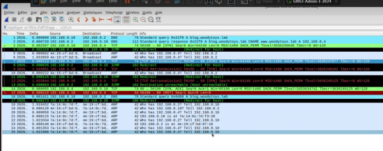

# Rapport d'Intervention : Rétablissement des Services Intranet

**Auteur :** Kylian Mostin-Vanderplanck  
**Date :** 14/01/2026  
**Sujet :** Indisponibilité du site intranet `www.woodytoys.lab` (Web Exercice 1)  
**Machines concernées :** `dhcp`, `resolver`, `soa`, `www`, `directeur`

---

## 1. Schéma du Labo


---

## 2. Description de l'Incident

### Symptômes observés
Depuis le poste client `directeur`, l'accès au site web interne est impossible.
* **Test effectué :** Tentative de connexion via le navigateur en ligne de commande `links`.
* **Résultat :** Échec de la connexion (soit "Host not found" si le DNS est éteint, soit "Connection refused" si le serveur Web est éteint).

### Contexte
Le réseau semble fonctionnel physiquement, mais aucun service applicatif (résolution de noms, attribution d'IP, hébergement web) ne répond. L'infrastructure semble être dans un état d'arrêt complet.

---

## 3. Analyse Technique

Le diagnostic a révélé que les démons (services) essentiels n'étaient pas démarrés sur les différents serveurs de l'infrastructure :

1.  **Infrastructure Réseau :** Les serveurs DHCP et DNS (`resolver` et `soa`) étaient inactifs, empêchant les clients d'obtenir une IP et de résoudre le nom de domaine `woodytoys.lab`.
2.  **Service Web :** Le serveur HTTP Apache2 sur la machine `www` était à l'arrêt.

---

## 4. Solution Mise en Œuvre

Pour rétablir le service, une procédure de démarrage séquentiel des services a été appliquée.

### 1. Démarrage de l'infrastructure réseau (DHCP & DNS)
Lancement des services sur les serveurs d'infrastructure pour rétablir la connectivité et la résolution de noms.

* **Sur la machine `dhcp` :**
    ```bash
    systemctl start isc-dhcp-server
    ```

* **Sur les machines `resolver` et `soa` :**
    ```bash
    systemctl start bind9
    ```

### 2. Démarrage du serveur Web
Lancement du serveur Apache pour servir la page intranet.

* **Sur la machine `www` :**
    ```bash
    systemctl start apache2
    ```

---

## 5. Validation

Une fois les services redémarrés, un test de validation a été effectué depuis le client `directeur` pour confirmer le bon fonctionnement de la chaîne complète (DHCP -> DNS -> Web).

* **Commande de test :**
    ```bash
    links "http://www.woodytoys.lab"
    ```

* **Résultat obtenu :**
    La page d'accueil s'affiche correctement avec le message "Bienvenue!".


Le service intranet est désormais pleinement opérationnel.


## 3. Description de l'Incident

### Symptômes observés
L'accès au site web `http://blog.woodytoys.lab` est lent ou échoue (Time out), alors que la résolution de nom semble fonctionner.

### Analyse de la trace réseau (Wireshark)
Une capture de paquets a été réalisée sur le client pour comprendre l'échec de la connexion TCP.



**Observations critiques :**
1.  **DNS OK (Trames 1-2) :** La résolution DNS fonctionne correctement. Le serveur `192.168.0.2` renvoie bien l'IP `192.168.0.4` pour le serveur Web.
2.  **TCP Retransmission (Trames 3, 7, 9) :** Le client tente d'initier une connexion TCP (SYN) vers le serveur Web mais ne reçoit pas d'accusé de réception (ACK) correct à temps.
3.  **ICMP Redirect (Trames 4, 8, 11) :** Le serveur DNS (`192.168.0.2`) envoie des alertes de redirection au client.

---

## 4. Diagnostic (Root Cause)

La présence des paquets **ICMP Redirect** provenant de `192.168.0.2` indique une anomalie de routage côté client.

* **Le problème :** Le client envoie les paquets destinés au serveur Web (`192.168.0.4`) vers le serveur DNS (`192.168.0.2`) au lieu de les envoyer directement sur le réseau local ou via la bonne passerelle.
* **La cause :** Une mauvaise configuration distribuée par le serveur DHCP. Le serveur DHCP a probablement configuré le client avec :
    * Soit une **Passerelle par défaut (Router)** pointant vers `192.168.0.2` (le DNS) au lieu de `192.168.0.254` (le Routeur).
    * Soit un **Masque de sous-réseau (Netmask)** incorrect (ex: `/32` au lieu de `/24`), forçant le client à passer par une passerelle pour joindre ses voisins directs.

---

## 5. Solution Mise en Œuvre

Correction de la configuration du serveur DHCP pour distribuer les bons paramètres de routage.

### Étape 1 : Correction du fichier dhcpd.conf
Sur la machine `dhcp` (`192.168.0.1`), édition du fichier de configuration :

```bash
nano /etc/dhcp/dhcpd.conf
